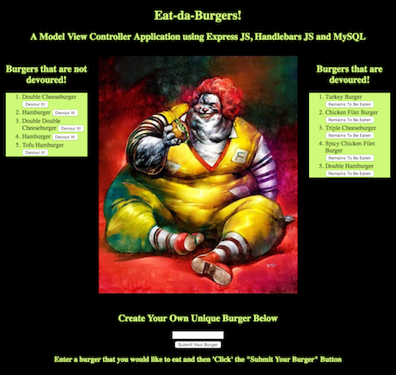

# Eat da Burger - A Node.js, Express.js and  Handlebars.js Application

A simple and fun Web Application built with Node.js, Express.js, and Handlebars to render the pages and with a MySQL Database to store the various data.

To see it deployed click here: https://eat-da-burger-plv.herokuapp.com

Description:

Users are presented with a list of Hamburgers that are stored using a MySQL Database.

A user also has the ability to add burgers of their own. Submit Button will update the first column of burgers a
that are 'to be devoured'.

Once a user clicks the devour button then the database is upadte along with a page refresh. The 'eaten' burgers will appear on the left.

User can also set the status of the burger back from "Eaten' to "To be Devoured".

Application was not created to solve any particular problem but was a fun way to begin to code with Express.js performing the back end routing. 

Technologies Used: 

HTML
CSS
Javascript
Express
Node
Handlebars
MySQl

Deployment Instructions:

To deploy please clone this repository to your local directory.

Once downloaded change your dirrectory Node-Express-Handlebars (cd Node-Express-Handlebars)

Run npm-install

MySQL - Please create a local instatnce of MySQL

From the data folder in the repository you will see the folowing two files:

seeds.sql
schema.sql

Run schema.sql in your own MySQL Client (i.e. MySQLWorkbenvh) to craet the database and then you can use seed.sql to 'seed' with some default data (or you can use your own).

With MySQL running type npm start in your Node-Express-Handlebars directory and enjoy.

If you have any questions or issues please feel free to contact me:

PaoloLaVita@outlook.com

